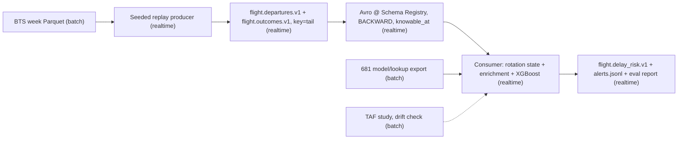

# MSDS 682 Final Project Proposal

Project title: Gate-Time Delay Risk: Streaming Flight-Delay Scoring and Alerts

Student name(s): Sebastian Steen, Aidan Percy

Project format: Team of two

Contribution plan (50-50, split at the schema; both can explain everything): Seb: replay export, producer, Avro contracts, outcome evaluator. Aidan: consumer enrichment, rotation state, scoring, banding, alerts. Shared: constants module, proposal, demo.

## 1. Problem Summary

Ops teams learn about delays after they happen. We score every departure at scheduled gate time, from pre-departure information only, for an ops and notification audience. Our MSDS 681 lakehouse produced a leakage-gated feature mart and a calibrated classifier for arrival delay >= 15 min (held-out ROC-AUC 0.739, PR-AUC 0.465, ECE 0.017); this project builds its streaming layer (instructor sign-off is a milestone). The deep dive: the leakage rule follows the data into the stream. Rotation features (an aircraft's prior legs today) exist only for schedule-consistent tail linkages, enforced in the consumer from the same constants module the batch tests import. A second finding prices forecast-vs-observed weather substitution per horizon.

## 2. Planned Data Source and Classification

Data source and official URL: BTS On-Time Performance, https://www.transtats.bts.gov; archived TAFs from the Iowa Environmental Mesonet. Data owner: US DOT (public domain). Classification: Hybrid: batch source (published 1 to 2.5 months late), realtime transport and inference, late ground truth. A seeded producer replays a committed one-week sample in scheduled-departure order: replay, stated plainly, not live data. The week comes from the 681 held-out window, never trained on. Access: public, keyless. Review path: local-first. Clone, `docker compose up` (Confluent Kafka + Schema Registry), one make target yields flowing events, a risk topic, an alert file, and an evaluation report, deterministically, README <= 10 steps; the same code deploys once to Confluent Cloud, screenshotted.

## 3. Architecture Sketch

## 4. Planned Tools and Packages

Python 3.11/uv; confluent-kafka (clients + Avro serde); fastavro; xgboost (inference only) plus Platt calibrator; pandas/pyarrow; pytest; MLflow; Docker Compose.

## 5. Feasibility Risks and Plan

Minimum result: replay to validated events to scored topic to alert file to evaluation against joined outcomes. Risks: rotation-state correctness (full-week parity against the 681 mart's rotation columns); late, out-of-order outcomes (TTL-bounded join; unmatched counted, never dropped); artifact size (release asset); TAF parse quality (hard go/no-go timebox). Milestones: (1) constants module + registered contracts; (2) deterministic local demo; (3) leakage tests that visibly fail when violated; (4) TAF skill-by-horizon study; (5) drift check, cloud screenshot, instructor sign-off for cross-course reuse.

## 6. AI Element and Disclosure

Planned AI element: the calibrated delay classifier inside the stream processor. Boundary: in, one validated pre-departure event; out, delay probability plus risk band. Verification: alert precision and recall at p >= 0.5 against joined outcomes (headline), per-horizon ECE and PR-AUC beneath it, leakage guards as consumer assertions. Fallback: smoothed route/carrier historical rate with a `model_unavailable` flag. AI use: Claude Code drafted this from the 681 repo and template; we reviewed and verified all claims.
