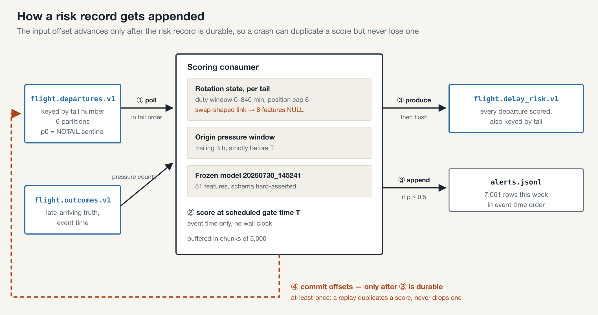
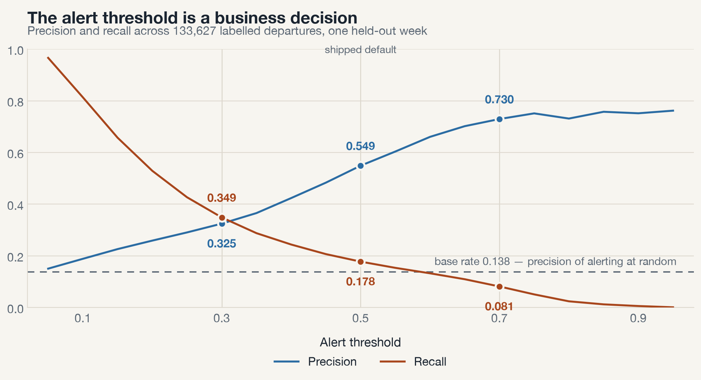
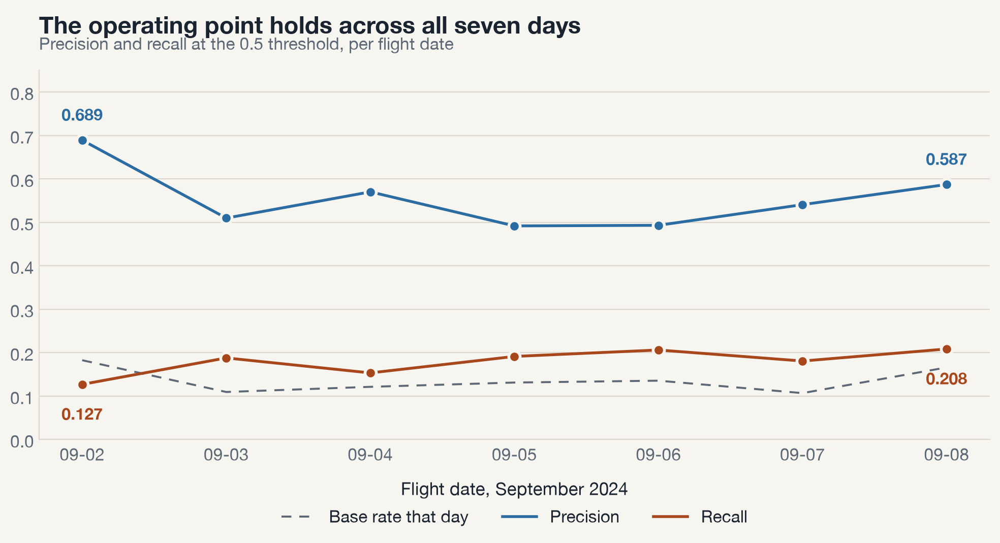
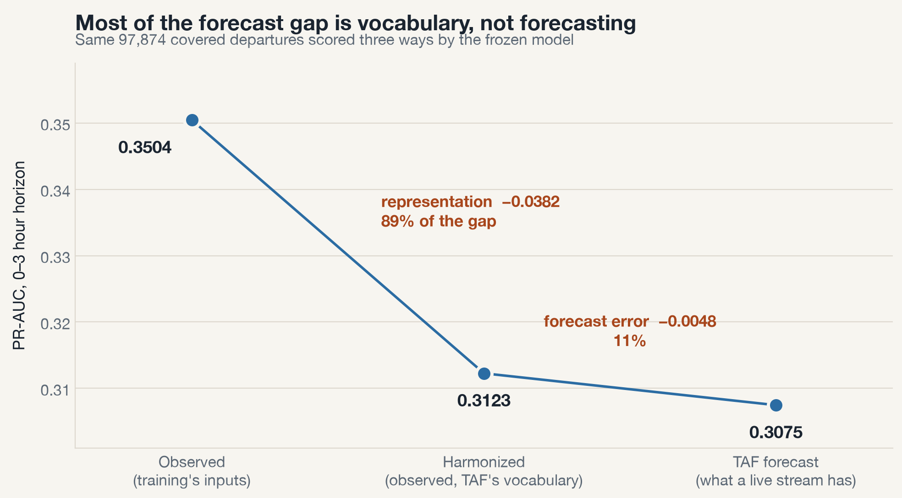

# Gate-Time Flight Delay Risk

MSDS 682 final project, written report. Sebastian Steen and Aidan Percy,
August 14, 2026. Code and review path: https://github.com/sebaleks/flight-delay-stream

## 1. Problem and useful result

Airline operations teams learn about delays when they happen. The useful
moment is earlier: at scheduled gate time, when a crew swap, a gate change, or
a passenger rebooking is still cheap. The problem: score every US domestic
departure, at its scheduled departure time, with the probability it will
arrive 15 or more minutes late, using only information knowable at that
moment.

The target user is an airline or airport operations team. The observable
result is the alert artifact: replaying one held-out week (2024-09-02 to
2024-09-08, 151,878 departures) through Kafka produces
`data/reference_output/alerts.jsonl`, 7,061 alerts at the 0.5 probability
threshold. A representative alert:

```json
{"carrier": "WN", "flight_number": "3460", "flight_date": "2024-09-08",
 "origin": "LAS", "dest": "RNO", "crs_dep_time": "2200",
 "delay_probability": 0.9745, "risk_band": "0.9-1.0", "threshold": 0.5,
 "issued_at": "2024-09-09T05:00:00+00:00", "mode": "replay"}
```

At that threshold, 54.9% of alerts are real delays, against a 13.8% base
rate: an alert is four times more likely to be a delay than a randomly chosen
flight.

## 2. Data and event contract

Sources (full provenance, ownership, rights, and limitations in
`docs/data_sources.md`):

- BTS On-Time Performance: every US domestic flight, schedule and outcome.
  Public domain, monthly files, replayed deterministically from a committed
  export.
- NOAA ISD hourly surface observations: origin-airport weather, joined as the
  last observation at or before scheduled departure within a 3-hour window.
- NOAA TAF terminal forecasts: used only by the forecast-substitution study
  in section 4, never by the shipped scorer.

Limitations: outcomes arrive hours after departure, so truth is late by
nature; the ISD export truncates at the week boundary, which the weather
features handle by their training-legal null path; 0.34% of flights have no
tail number and are scored without rotation features.

The event contract is three Avro topics in a Schema Registry with BACKWARD
compatibility. The registry is the only contract definition; there is no
application-side schema copy.

| Topic | Content | Key |
|---|---|---|
| `flight.departures.v1` | one scheduled departure, schedule fields only | tail number |
| `flight.delay_risk.v1` | the score, band, alert flag, and its basis fields | tail number |
| `flight.outcomes.v1` | the realized outcome, at actual-arrival event time | tail number |

Every field carries a `knowable_at` annotation in {schedule,
pre_departure_stream, post_departure}, and a contract test proves no
post-departure field exists in any schema the scorer reads. A representative
departures event:

```json
{"flight_date": "2024-09-02", "carrier": "WN", "flight_number": "469",
 "origin": "OAK", "dest": "SAN", "crs_dep_time": "0610",
 "crs_dep_ts_utc": "2024-09-02T13:10:00Z", "crs_arr_time": "0745",
 "crs_elapsed_min": 95, "distance_mi": 446, "tail_number": "N238WN",
 "mode": "replay", "is_warmup": false}
```

Keying by tail number is the load-bearing choice: it guarantees per-aircraft
ordering, which is what makes in-stream rotation state possible. Null tails
ride a `NOTAIL` sentinel to a dedicated partition.

## 3. Architecture and working implementation



The path: a seeded replay producer streams the week into
`flight.departures.v1` in event-time order. The consumer enriches each event
(historical rates, origin weather, per-tail rotation state), asserts the
51-feature frame against the training feature list, scores it with the frozen
2024-06-30 XGBoost classifier plus Platt calibration, and produces the score
to `flight.delay_risk.v1`, appending an alert line when p >= 0.5. A separate
producer emits outcomes at actual-arrival event time, and the evaluator joins
the two streams to measure alert quality. Offsets are committed only after
the score is produced, giving at-least-once processing; the evaluator counts
duplicates rather than trusting exactly-once.

Why this design:

- Local first. Docker Compose (Confluent Kafka 8.3.1, KRaft, Schema
  Registry), no cloud dependency, zero cost, and a reviewer path of one
  command.
- Deterministic replay. Event time only, no wall clock in any scored field:
  two runs produce byte-identical alert files and evaluation reports, which
  turns the committed reference output into a regression test.
- Leakage boundary enforced in-stream. Predictors use only
  pre-departure-knowable information, and the rule extends to linkage: a
  rotation chain restructured by a day-of tail swap is itself a day-of
  outcome, so swap-shaped links get NULL rotation features. The state
  machine's full-week output matches the batch feature mart exactly.

The representative example above (WN469, OAK to SAN) enters as a departures
event, is enriched with Oakland weather and its aircraft's inbound leg,
and leaves as a delay-risk event scored at its 06:10 local gate time.

## 4. Evidence and reproducibility

Evaluation (`data/reference_output/streaming_eval.json`, joined by the
TTL-bounded evaluator; every one of the 151,878 risk events lands in exactly
one counter):

| Metric | Value |
|---|---|
| Precision at p >= 0.5 | 0.549 (5,950 evaluated alerts) |
| Recall at p >= 0.5 | 0.178 |
| Precision at p >= 0.7 | 0.730 |
| PR-AUC | 0.340 (base rate 0.138) |
| Calibration error (10-bin ECE) | 0.033 |
| Labeled departures | 133,627 (warm-up day and cancellations excluded into named counters) |





The second finding: training used observed weather, but at scoring time only
forecasts exist. Substituting TAF forecasts costs 0.043 PR-AUC in the 0-3
hour horizon, and a harmonization control shows 89% of that gap is vocabulary
mismatch between the two encodings, not forecasting error; the true forecast
cost is 0.005, below the retrain trigger.



AI role: disclosed and verified AI-assisted development, bounded by the
handoff prompts and gated by parity and byte-identity checks. Task, evidence,
decisions, verification, and limitations are in `AI_USAGE.md`. Individual
contributions are in `docs/CONTRIBUTIONS.md`: the work split at the schema,
Sebastian upstream (producers, contracts, evaluator, platform), Aidan
downstream (consumer, rotation, alerts, TAF study).

Review path (README quickstart, 9 steps): `uv sync`, fetch the model
artifacts, `make demo` brings up the stack, registers contracts, replays the
week, scores it, and prints the evaluation; expected output is stated
verbatim in the README, `make test` runs the 59-test suite, `make down`
cleans up. Without running anything, the committed reference output shows the
system's artifacts, and because replay is deterministic, a diff against them
is the acceptance check.
