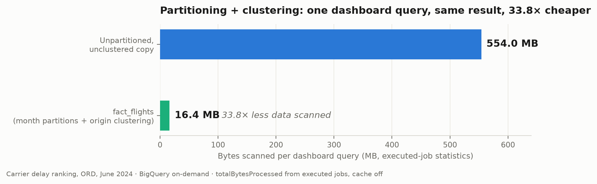

# fact_flights partitioning + clustering benchmark

> Second benchmark in this directory:
> [`serving_preload_benchmark.md`](serving_preload_benchmark.md) — the inference
> path, 6 BigQuery queries per prediction to 0 (390× latency, $1,315 → $0 per
> 100k predictions). This one is about the analytics layer's scan volume.

**Claim (blog/resume-ready):** Partitioning `fact_flights` by month and
clustering by origin airport cut a representative dashboard query — the carrier
delay ranking for one airport-month (ORD, June 2024) — from **554.0 MB scanned
to 16.4 MB, a 33.8× reduction**, measured from executed BigQuery job statistics
with the cache disabled. At on-demand pricing ($6.25/TiB) that is
**$0.00315 → $0.000095 per query (33×)**, roughly **$306 saved per 100,000
dashboard queries**, and median runtime dropped 1.7× (425 ms → 249 ms). Same
query, same result — the only difference is table layout.



## Before / after (executed-job statistics)

| | Unpartitioned, unclustered copy | `fact_flights` (month partitions, origin/dest/carrier clustering) | Improvement |
|---|---|---|---|
| Bytes scanned (`totalBytesProcessed`, executed jobs) | 553,975,488 B (554.0 MB) | 16,411,824 B (16.4 MB) | **33.8×** |
| Bytes billed (`totalBytesBilled`, executed jobs) | 554,696,704 B | 16,777,216 B | 33.1× |
| Est. cost per query (on-demand $6.25/TiB) | $0.003153 | $0.0000954 | **33.1×** |
| Median runtime (3 runs, cache off) | 425 ms | 249 ms | 1.7× |
| Cost per 100,000 queries | $315.31 | $9.54 | −$305.77 |

For reference only — dry-run estimates, which are **not** exact for clustered
tables (BigQuery returns an upper bound before block pruning; see the
`totalBytesProcessedAccuracy` field):

| | Dry-run estimate | `totalBytesProcessedAccuracy` |
|---|---|---|
| Unpartitioned copy | 553,975,488 B | `PRECISE` |
| `fact_flights` (clustered) | 16,411,824 B | `UPPER_BOUND` |

For this query the executed scan happened to equal the upper-bound estimate;
the headline numbers above are from executed jobs regardless, because only
executed `totalBytesProcessed` is exact for clustered tables.

## Method

- Queries: `benchmark_query.sql` — TWO labeled blocks, identical except the
  table (block 1 = optimized `fact_flights`, block 2 = the baseline copy):
  carrier delay ranking filtered to one month (`date_key`, the partition
  column) and one origin airport (`origin_airport_key`, the first clustering
  column); the exact drill-down a dashboard fires. Run **one block per job**
  with a fresh job id each run, per the file header — never pipe the whole
  file (two statements become one SCRIPT job whose stats blend the variants).
- **Bytes and runtimes come from executed job statistics**
  (`statistics.query.totalBytesProcessed` / `totalBytesBilled`, job
  `startTime`→`endTime`), which are exact for clustered and unclustered tables
  alike. 3 runs per variant, `cacheHit: false` verified on all six, run
  2026-07-09. Dry-run figures are reported only as labeled estimates with
  their accuracy field.
- Baseline recreate DDL (verified unpartitioned/unclustered via
  INFORMATION_SCHEMA; dropped after measurement):

  ```sql
  CREATE OR REPLACE TABLE `<project>.flight_delays_gold.fact_flights_benchmark_baseline`
  AS SELECT * FROM `<project>.flight_delays_gold.fact_flights`;
  -- plain CTAS: no PARTITION BY, no CLUSTER BY
  ```

- Both variants benefit equally from BigQuery's columnar pruning (only the five
  referenced columns are read); the 33.8× is partition + cluster pruning alone.
- Honest caveat: runtime gains are modest at 20M rows — BigQuery parallelizes
  both variants easily. Bytes and dollars are the story, and they scale
  linearly with data volume and dashboard traffic.
