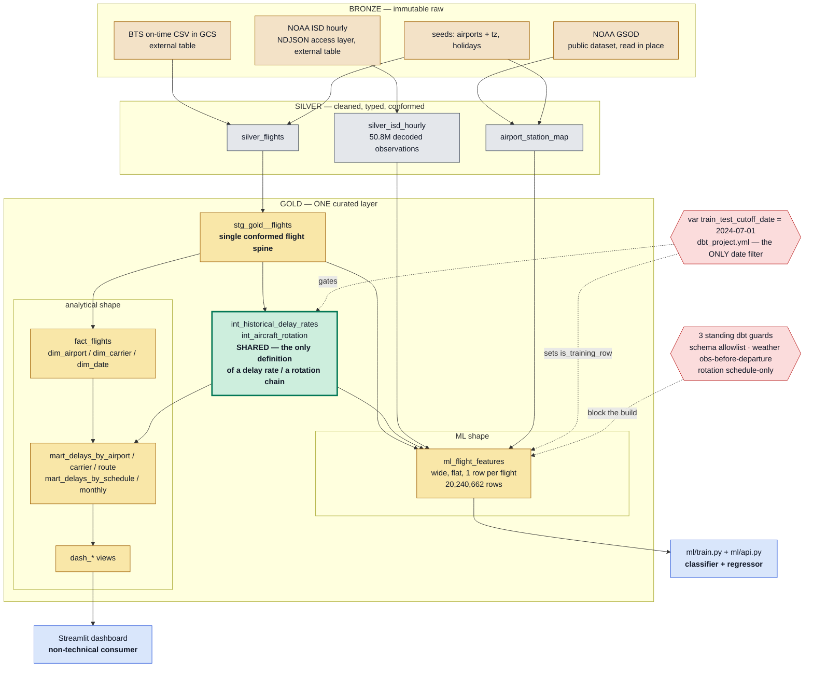
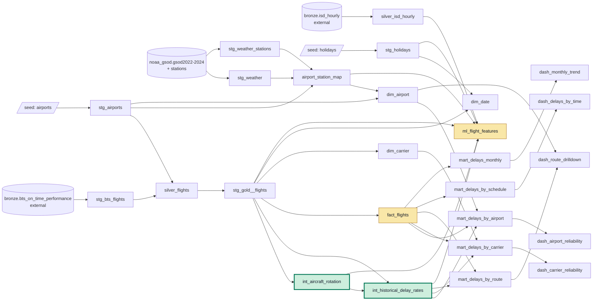

# One gold layer, two consumers — lineage and the boundary that makes it safe

**What this document proves.** The lakehouse serves an analytical consumer
(the Streamlit dashboard) and an ML consumer (the classifier + regressor) from
the **same curated gold layer, with no data or logic duplicated between them** —
and the correctness constraint that makes sharing safe, the pre-departure /
train-test boundary of CLAUDE.md §9, is enforced **in the pipeline** rather than
in either consumer.

Companion documents: [`leakage_discipline.md`](leakage_discipline.md) is the
authority on the boundary itself; [`benchmarks/`](benchmarks/) covers the
partition/cluster benchmark; [`../ml/README.md`](../ml/README.md) reports the
held-out metrics.

---

## Figure 1 — the shared spine and its two shapes

**Read the figure at the green node.** Both branches pass through
`int_historical_delay_rates`. That is not a stylistic convergence — it is the
no-duplication guarantee expressed as graph topology, and it is the reason the
dashboard and the model can never disagree about "the delay rate for ORD."

**Read it again at the red nodes.** One dbt variable is the entire train/test
firewall for *both* consumers, and three build-blocking tests sit on the ML
mart. The boundary is a property of the warehouse, not a convention two Python
codebases are each trusted to honor.

## What "no duplication" means here, mechanically

Four separate mechanisms, none of them convention:

1. **Topology.** `int_historical_delay_rates` is `ref()`'d by
   `mart_delays_by_airport`, `mart_delays_by_carrier`, `mart_delays_by_route`
   **and** `ml_flight_features`. Its header states the rule: *"Both the analytics
   marts and the ML feature mart must ref() this model; nothing recomputes these
   rates."* `int_aircraft_rotation` is likewise defined once and read by the
   rates model and the ML mart. The two marts that carry no rates
   (`mart_delays_by_schedule`, `mart_delays_monthly`) store **additive counts and
   sums only**, so no rate is ever defined a second time to begin with.
2. **One cutoff.** `var('train_test_cutoff_date')` filters the shared rates model
   ([`int_historical_delay_rates.sql:59`](../dbt/models/gold/shared/int_historical_delay_rates.sql#L59))
   and derives the split column
   ([`ml_flight_features.sql:167`](../dbt/models/gold/ml/ml_flight_features.sql#L167)).
   `dbt_project.yml` states the invariant: *"Change it HERE only — no model may
   inline a cutoff literal."*
3. **One aggregation macro.** `delay_measures()` supplies the identical
   measure block to all three entity-grain marts, so even the arithmetic is
   written once.
4. **Serving reads the mart, not a reimplementation.** `ml/serving.py` pulls
   `hist_*` out of `ml_flight_features` with `ANY_VALUE` (verified
   constant-within-entity) rather than re-deriving the smoothing formula in
   Python, so inference reproduces training values byte-for-byte.

The claim is checked, not asserted: `dashboard/verify.py` recomputes every
dashboard rate directly in BigQuery as an independent `GROUP BY` oracle and
asserts the app's arithmetic matches — **9 checks, 0.0 difference**.

## Figure 2 — the full dbt DAG

Every model, as built. Figure 1 is this graph with the staging detail collapsed.

Note what the ML branch does **not** do: it never reads `fact_flights` or any
`dim_*`. The two shapes are siblings descending from `stg_gold__flights`, which
is exactly CLAUDE.md §4 — *"do not make ML consumers join dimensions at train
time."* Sharing the layer is not the same as sharing the shape.

---

## Why the **gold** layer feeds the ML pipeline

The deep dive requires defending which layer feeds ML. The answer is gold, and
the reason is not that gold is "the cleanest" — it is that **the ML feature mart
is where a correctness constraint becomes a build artifact.**

### 1. The boundary has to be testable, and only gold can test it

The pre-departure rule and the train/test cutoff are correctness constraints
that decide whether *every* reported metric is honest. In gold they are SQL, so
they are checkable by the build:

- `assert_ml_features_no_leakage` diffs the built mart's columns against an
  audited allowlist — a renamed outcome column or a new un-audited feature
  fails **by default**.
- `assert_ml_weather_obs_before_departure` proves, value-level over the full
  table, that every weather observation sits at or before scheduled departure
  and inside the staleness ceiling.
- `assert_ml_rotation_schedule_only` independently rebuilds the entire rotation
  feature set from schedule columns and compares to the mart — a chain
  accidentally built on actual times diverges massively and fails.

Move the mart into Python and all three become unwritable. There is no artifact
to diff, no build to block, and the boundary degrades to a code-review promise.
`ml/audit.py` then re-asserts the same allowlist against `INFORMATION_SCHEMA` at
train time, so the contract is enforced on both sides of the handoff.

### 2. The shared-definition requirement forces it

The `hist_*` delay rates are needed by the BI marts *and* by the model. Exactly
one of two things can be true: either they are computed once in gold and both
consumers read them, or the model recomputes them in pandas. The second option
guarantees drift between the dashboard's ORD delay rate and the model's — and
guarantees it **silently**, because nothing compares the two. Feeding ML from
gold is what makes the single definition possible; feeding it from silver makes
duplication mandatory.

### 3. Silver has no train/test concept and none of the expensive joins

Silver is conformed but flat: it has no cutoff, no historical rates, no rotation
chain, no as-of weather. Everything the model needs beyond raw columns is
built in the gold layer, and built as set-based SQL — a 50.8M-row ISD decode and
an as-of join reduced to a `(station_id, obs_date)` equi-key so it hash-joins
about two days per flight instead of a station's full three-year history. That
is warehouse work by CLAUDE.md §5, and it is why the mart builds in ~14 s
instead of becoming a per-training-run Python job.

### 4. Bronze is not a candidate

Bronze is all-`STRING` external CSV, plus packed ISD fields with
per-station heterogeneous columns. Training off bronze means re-implementing
the entire decode on every run, in Python, with no test coverage and a 9.3 GB
re-scan each time.

### What this choice costs — stated, not hidden

A gold-mart-as-contract is not free, and the defense is stronger for naming the
bill:

- **Iteration is a rebuild.** A new feature is a dbt change plus a mart rebuild
  plus a retrain, not a notebook cell. That is the deliberate trade: slower
  edits in exchange for a boundary that cannot be bypassed by accident.
- **The shared rates aggregate the whole pre-cutoff window.** A validation slice
  carved from inside the training window therefore carries slightly leaky
  `hist_*` values. This is a direct consequence of requiring a *single*
  definition rather than per-flight as-of-date rates. It is measured, not
  assumed — the leak shifts XGBoost's validation PR-AUC by +0.00079 vs
  LightGBM's +0.00020, enough to distort a close ranking, and it did not flip
  the current selection. See [`leakage_discipline.md`](leakage_discipline.md)
  rule 10; re-derive fit-window rates for any closer or wider selection.

### The payoff, in the numbers that matter

The split is exact and time-ordered — 16,678,880 training rows
(2022-01-01 … 2024-06-30) and 3,561,782 held-out rows (2024-07-01 … 2024-12-31),
asserted disjoint at train time and never re-derived in Python — and the
held-out result is **ROC 0.7389 / PR-AUC 0.4652** for the classifier and
**RMSE 49.26 / MAE 18.99** for the regressor, reproducible byte-identically
across full mart rebuilds. Those numbers are trustworthy *because* of where the
mart lives, not in spite of it.
